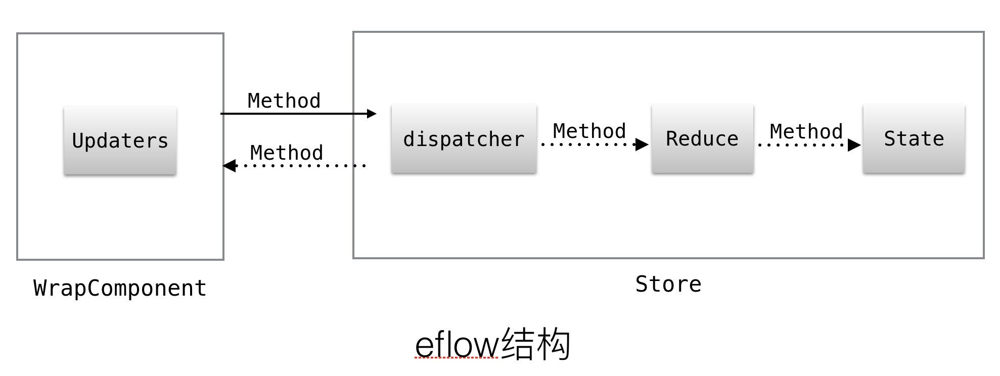

# react-eflow
##### eflow 通过使用默认配置策略来管理数据流，所以使用起来高效简单。

1. 使用Store管理所有数据，通过Store的方法调用，Store内部既可以dispatch又能reduce。Store的方法有2个作用，既可以用于处理相关业务数据，又可通过该方法的dispatch发布数据，数据存在Store中(state)，属性名称与该方法同名，起到reduce功能。
2. 通过wrapComponent包装用户组件 `wrapComponent(SomeComponent, [xxxStore.doSomething])`
在SomeComponent的props.doSomething中则自动绑定xxxStore在doSomething方法中dispatch的参数合集数据


### 安装

```
npm install --save react-eflow 
```

### 使用介绍

##### 1. 新建Store子类，并实例化

```
import {Store} from 'react-eflow'
class SomeStore extends Store{
  constructor(options){
    super(options);
  }

  doSomeThing(){
    //通过this.doSomeThing获取该方法的dispatch
    var dispatch = this.doSomeThing.dispatch;
    //发布相关数据，发布后在该对象内部state的doSomeThing属性包含发布值
    dispatch({request: true});
  }
//实例化
export default new SomeStore();
```

##### 2. 调用Store的实例

```
import {wrapComponent} from 'react-eflow'
import someStore from '../store/SomeStore'

class SomeComponent extends Component {
  constructor(props){
    super(props);
    //调用someStore.doSomeThing
    someStore.doSomeThing();
    //调用完成后，someStore内部state值： {doSomeThing:{request: true}}
  }
  render(){
    return <div></div>;
  }
}

export default SomeComponent;
```

##### 3. 同步Store数据到组件

```
import {wrapComponent} from 'react-eflow'
import someStore from '../store/SomeStore'

class SomeComponent extends Component {
  constructor(props){
    super(props);
    someStore.doSomeThing();
  }
  render(){
    {/*在this.props.doSomeThing中则会有{request: true} 对象*/}
    let request = this.props.doSomeThing.request;
    return (
      <div>
        request: {request ? 'true' : 'false'}
      </div>
    );
  }
}
//需要先包装SomeComponent组件，再绑定someStore.doSomeThing方法，
//使someStore.doSomeThing.dispatch触发后自动更新数据到SomeHeader组件的props.doSomeThing属性上
//在render内部通过props即可获取request值
export default wrapComponent(SomeComponent, [someStore.doSomeThing]);
```
### 其他文档
#### [Api介绍](./docs/Api.md)
#### [Store使用介绍](./docs/Store.md)
#### [wrapComponent使用介绍](./docs/wrapComponent.md)
#### [Store使用装饰注入参数](./docs/StoreDecorator.md)
#### [wrapComponent使用装饰](./docs/wrapComponent.md)


